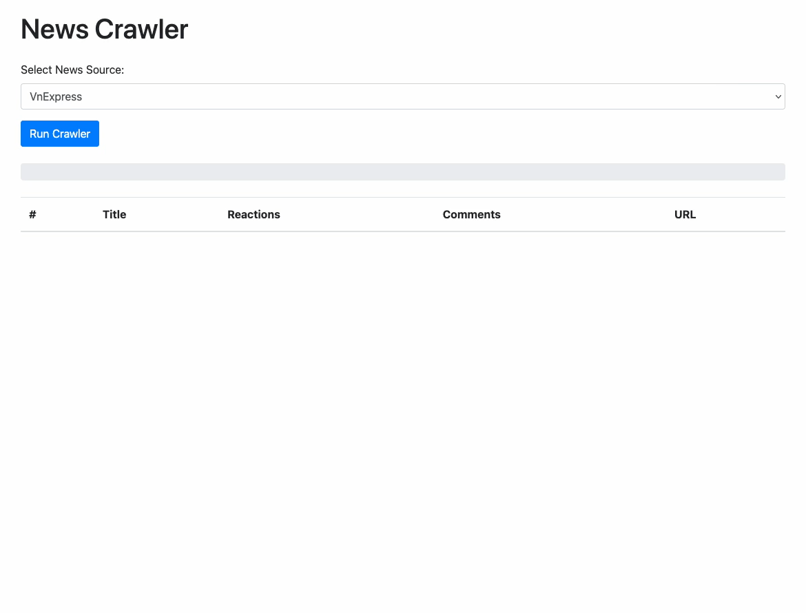
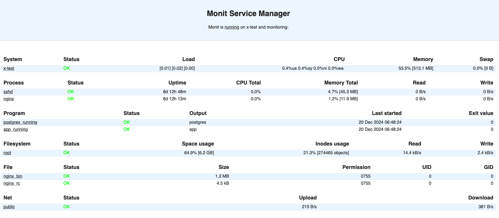

# news-crawler
 

Crawlers from VnExpress and TuoiTre to find out the most popular news.

## Demo



You can try it out at [https://news.toanhoczero.com](https://news.toanhoczero.com)

## How it works

1. Using sitemaps to get all the news urls for the last 7 days. (exclude the current day)
- VnExpress: [https://vnexpress.net/sitemap.xml](https://vnexpress.net/sitemap.xml)
- TuoiTre: [https://tuoitre.vn/sitemaps/index.rss](https://tuoitre.vn/sitemaps/index.rss)

2. Gather information from the urls (if needed).
- VnExpress: [https://gw.vnexpress.net/ar/get_basic](https://gw.vnexpress.net/ar/get_basic) to get the object types

3. Fetch all comments for each news and calculate total reactions.
- VnExpress: [https://usi-saas.vnexpress.net/index/get](https://usi-saas.vnexpress.net/index/get) to get the comments
- TuoiTre: [https://id.tuoitre.vn/api/getlist-comment.api](https://id.tuoitre.vn/api/getlist-comment.api) to get the comments

4. Display top 10 news with most comment's reactions and realtime crawling progress through the web UI with the help of Server Send Events.

## Prerequisites

- Node.js 22
- Docker
- Docker Compose

## Run locally

1. Clone the repository
```
git clone https://github.com/minhpq331/news-crawler.git
```

2. Install dependencies
```
npm install
```

3. Run the crawler with hot reload
```
npm run dev
```

4. Open `http://localhost:3000` to view the web UI.

Or you can use docker compose to quickly run the crawler without installing any dependencies.

1. Run `docker compose up --build` to start the development server with hot reload.
2. Open `http://localhost:3000` to view the web UI.

To run the test, you can use `npm run test` or `npm run test:coverage` to display coverage report.

## Run in production

1. Copy `docker-compose.deploy.yml` to production server.
2. Run `docker compose -f docker-compose.deploy.yml up -d` to start the production server.
3. By default, the server will be deployed to `http://127.0.0.1:3000` and need a reverse proxy like nginx to handle domain mapping / SSL termination. You can change the port to 80 if you want to expose it directly.

## Some caveats

- The comment count for each news on my site may differ from the number of comments display on the original site due to the different way to count the comments. VnExpress counts the all the comments including replies, while my site only counts the top level comments. This apply to reactions as well because of your example.
- VnExpress is blocking sitemap access from Vietnam IP addresses, so in order to run it locally, you have to use a VPN to make it work.
- For the simplicity of this project, I'm not using any database to store the data and will crawl the data from beginning every time you run the crawler.
- http / sock proxy is common way to bypass IP blocking / restriction when running crawler, but it's not implemented in this project yet.

## Monitoring

I'm using [Monit](https://mmonit.com/monit/) to basic monitoring the server status with some insights about the host's CPU, memory, disk, network, process, etc. You can see the dashboard at [https://mon.toanhoczero.com/](https://mon.toanhoczero.com/). The current scrape interval is 15 seconds.

User and password for the dashboard is `admin:monit`. This user is read only.


